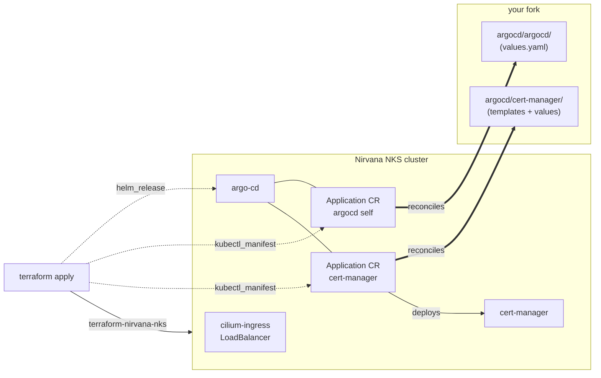

<div align="center">
  <a href="https://nirvanalabs.io">
    
  </a>

  [Sign Up](https://nirvanalabs.io/sign-up) · [Docs](https://docs.nirvanalabs.io) · [API](https://docs.nirvanalabs.io/api) · [Examples](https://github.com/nirvana-labs-examples) · [Terraform](https://registry.terraform.io/providers/nirvana-labs/nirvana/latest)
</div>

---

# ArgoCD GitOps on NKS

Starter example for deploying [Argo CD](https://argo-cd.readthedocs.io) on a Nirvana Labs NKS cluster with GitOps-style self-management.

> This repo is a starting point, not production-ready. It shows one cluster, one Application (ArgoCD itself), and a minimal cert-manager wiring so you get a real TLS URL. Extend it by adding more Applications pointing at additional paths under `argocd/`.

## Architecture



After the two-phase `terraform apply`, any change to `argocd/argocd/values.yaml` or `argocd/cert-manager/` in your fork reconciles into the cluster without re-running Terraform.

## Prerequisites

- [Terraform](https://www.terraform.io/downloads.html) ≥ 1.5
- [kubectl](https://kubernetes.io/docs/tasks/tools/) + [helm](https://helm.sh/docs/intro/install/) (for manual install path and verification)
- A [Nirvana Labs API key](https://console.nirvanalabs.io)
- A fork of this repo — public fork = zero credentials; private fork = SSH deploy key (see below)

## Quick start (public IP + Let's Encrypt)

1. **Fork this repo** on GitHub. Clone your fork locally.

2. **Fetch Helm chart dependencies** — `charts/` directories are gitignored, so the upstream chart tarballs need to be fetched once per clone:

   ```bash
   helm dependency build argocd/argocd
   helm dependency build argocd/cert-manager
   ```

3. **Set required variables:**

   ```bash
   export NIRVANA_LABS_API_KEY=<your key>
   export TF_VAR_project_id=<your project id>
   export TF_VAR_argocd_repo_url=https://github.com/<your-user>/argocd-gitops-nks.git
   ```

4. **First apply** — creates the cluster:

   ```bash
   cd terraform
   terraform init
   terraform apply
   ```

   Wait ~5 minutes for the control plane to become reachable.

5. **Enable the public IP on cilium-ingress:**

   - Open the [Nirvana Console](https://console.nirvanalabs.io).
   - Clusters → your cluster → **Load Balancers** tab.
   - Click the ⋮ menu next to `cilium-ingress` → **Enable Public IP**.
   - Copy the public IP that appears.

6. **Second apply** — installs cert-manager, ArgoCD, and the self-management Application:

   ```bash
   export TF_VAR_ingress_public_ip=<the IP from step 5>
   export TF_VAR_letsencrypt_email=<your email>
   export TF_VAR_fetch_kubeconfig=true
   terraform apply
   ```

7. **Open the UI** — Terraform prints the URL and a one-liner for the admin password:

   ```bash
   terraform output -raw argocd_password_cmd | sh
   # Open https://argocd.<ip>.nip.io
   ```

   Cert-manager takes 30-60 seconds to complete the HTTP-01 challenge; if the page shows a TLS warning on the first load, wait and refresh.

## How self-management works

The second apply creates two ArgoCD `Application`s:

- **`argocd`** — `path: argocd/argocd` — ArgoCD manages its own Helm values.
- **`cert-manager`** — `path: argocd/cert-manager` — cert-manager chart + Let's Encrypt `ClusterIssuer` are reconciled from the repo, not Terraform.

From now on, any change to `argocd/argocd/values.yaml` or `argocd/cert-manager/` in your fork — new RBAC rules, changed domain, additional configmaps — gets applied by ArgoCD without Terraform involvement. To add a new app:

1. Create `argocd/<new-app>/` with a Helm chart or Kustomize manifests.
2. Create another ArgoCD Application (in `terraform/main.tf` or directly in the cluster) pointing at that path.

## Using your own hostname

Set `TF_VAR_argocd_hostname=argocd.example.com` and create a DNS A record pointing at `TF_VAR_ingress_public_ip`. Let's Encrypt HTTP-01 works identically for custom hostnames.

## HTTP-01 vs DNS-01

- **HTTP-01** (default): Let's Encrypt validators hit port 80 on your ingress IP. Works out of the box with the nip.io hostname. Requires a **publicly reachable** IP.
- **DNS-01**: Validates by creating TXT records in your DNS zone. Needed for wildcard certs and the only option if your ingress IP is private. Swap the `solvers[0].http01` block in the `ClusterIssuer` for a DNS-01 solver configured with your DNS provider's API credentials (see [cert-manager docs](https://cert-manager.io/docs/configuration/acme/dns01/)).

## Private-only access (no public IP)

Leave `ingress_public_ip` unset. Terraform applies against the private VIP (`module.nks.ingress_vip`). HTTP-01 will not validate, so the ingress cert remains pending.

Options for private TLS:

1. **`kubectl port-forward svc/argocd-server -n argocd 8080:443`** — occasional access, accept the self-signed cert ArgoCD ships with by default.

2. **DNS-01 + a domain you own** — swap the ClusterIssuer to DNS-01 and set `argocd_hostname` to a name whose A record points at the private VIP. DNS-01 validates against your DNS provider's API (not the ingress), so the cert is issued even though the VIP isn't internet-reachable. Pair with WireGuard for actual access:
   [nirvana-labs-examples/wireguard-vpn](https://github.com/nirvana-labs-examples/wireguard-vpn).

## Alternative install paths

### Manual helm

Skip Terraform for the ArgoCD install — Terraform still needs to create the cluster:

```bash
cd terraform && terraform apply   # first apply only, creates cluster
# ... enable public IP, fetch kubeconfig manually ...

helm install argocd ./argocd/argocd \
  --namespace argocd --create-namespace \
  --set argo-cd.global.domain=argocd.<ip>.nip.io \
  --set argo-cd.server.ingress.extraTls[0].hosts[0]=argocd.<ip>.nip.io
```

### argocd-autopilot

[argocd-autopilot](https://argocd-autopilot.readthedocs.io/) installs ArgoCD and opinionates the GitOps repo layout in a single command. Compatible with NKS — point it at your empty cluster once cert-manager is in place.

## Private repo / SSH deploy key

For a private fork:

1. Generate a deploy key:
   ```bash
   ssh-keygen -t ed25519 -f ~/.ssh/argocd-gitops-nks-deploy -C "argocd-gitops-nks deploy"
   ```
2. Add the public half (`.pub`) to your fork on GitHub under Settings → Deploy keys (read-only is sufficient).
3. Use the SSH form of the repo URL and point Terraform at the private key file:
   ```bash
   export TF_VAR_argocd_repo_url=git@github.com:<your-user>/argocd-gitops-nks.git
   export TF_VAR_repo_ssh_private_key_path=~/.ssh/argocd-gitops-nks-deploy
   ```

Terraform creates a `kubernetes_secret` labeled `argocd.argoproj.io/secret-type=repository`. The key content is stored in Terraform state — treat the state file as sensitive (encrypt at rest, don't commit).

## Terraform variables

| Variable | Default | Required? |
|---|---|---|
| `project_id` | — | yes |
| `region` | `us-sva-2` | no |
| `cluster_name` | `argocd-gitops-demo` | no |
| `node_count` | `2` | no |
| `instance_type` | `n1-standard-8` | no |
| `fetch_kubeconfig` | `false` | yes on second apply |
| `ingress_public_ip` | `null` (→ private VIP) | no |
| `argocd_hostname` | `null` (→ `argocd.<ip>.nip.io`) | no |
| `argocd_repo_url` | — | yes |
| `argocd_repo_branch` | `main` | no |
| `repo_ssh_private_key_path` | `null` | only for private forks |
| `letsencrypt_email` | `null` | yes for Let's Encrypt |
| `letsencrypt_acme_server` | staging | flip to prod URL when ready |

## Cleanup

```bash
cd terraform
terraform destroy
```

The cluster and all resources on it are removed. Let's Encrypt orders and account keys persist on the LE side but don't block re-creation on a new IP.

## License

Apache 2.0. See [LICENSE](./LICENSE).
